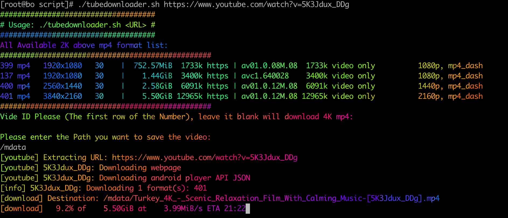
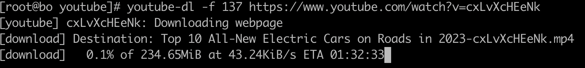
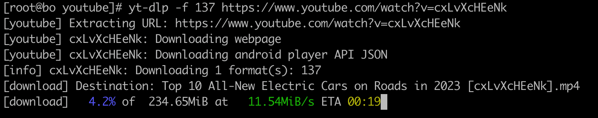

---

#### yt-dlp setup

> I have a write a  script to install and download the [yt-dlp](https://github.com/yt-dlp/yt-dlp#installation)  which is very powerful video downloader , so much cool than [YouTube-dl](https://github.com/ytdl-org/youtube-dl) including patched [ffmpeg](https://github.com/yt-dlp/FFmpeg-Builds#downloads). The biggest improvement is fixed at the download speed issue when use `youtibe-dl`.

#### Reference:

- [https://github.com/ytdl-org/youtube-dl](https://github.com/ytdl-org/youtube-dl)
- [https://github.com/yt-dlp/FFmpeg-Builds#downloads](https://github.com/yt-dlp/FFmpeg-Builds#downloads)
- [https://github.com/yt-dlp/yt-dlp#installation](https://github.com/yt-dlp/yt-dlp#installation)

#### Script

- [https://github.com/Jas0n0ss/yt-dlp-setup](https://github.com/Jas0n0ss/yt-dlp-setup)
```bash
# install yt-dlp
$ wget -L https://raw.githubusercontent.com/Jas0n0ss/yt-dlp-setup/main/script/yt-dlp-install.sh && chmod +x yt-dlp-install.sh
$ ./yt-dlp-install.sh
# wget -L https://raw.githubusercontent.com/Jas0n0ss/yt-dlp-setup/main/script/tubedownloader.sh && chmod +x tubedownloader.sh
./tubedownloader.sh <URL>
```


#### Yt-dlp common used example

```bash
 # Best quality of video start with mp4
 yt-dlp -S "ext" -P <PATH> --restrict-filenames <URL>
 # list all available both video and audio from URL
 yt-dlp -F <URL>
 yt-dlp -f <id> -P <PATH> --restrict-filenames <URL>
```
more usage:
- [https://github.com/yt-dlp/yt-dlp#output-template-examples](https://github.com/yt-dlp/yt-dlp#output-template-examples)
- [https://github.com/yt-dlp/yt-dlp#format-selection-examples](https://github.com/yt-dlp/yt-dlp#format-selection-examples)

`youtube-dl` VS` yt-dlp`




